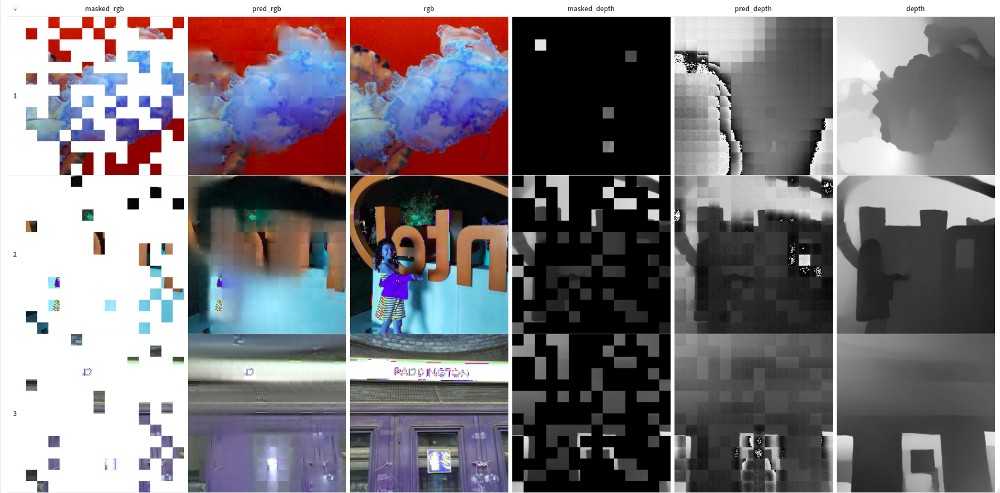

# Pretrain MultiMAE for RGB-D Salient Object Detection

## Things different from original implementation of [MultiMAE](https://github.com/EPFL-VILAB/MultiMAE)

- Aim to train with Python 3.10 on Kaggle
- Use `typed-argument-parser` instead of `argparse.ArgumentParser` => Provide type hints, better for understanding code and ease of debugging.

## Results

More details on [Wandb report](https://api.wandb.ai/report/thinh-huynh-re/0e33ob97)




## Acknowledgement

This project is inspired by [MultiMAE](https://github.com/EPFL-VILAB/MultiMAE)


```bash
@article{bachmann2022multimae,
  title={MultiMAE: Multi-modal Multi-task Masked Autoencoders},
  author={Bachmann, Roman and Mizrahi, David and Atanov, Andrei and Zamir, Amir},
  journal={arXiv preprint arXiv:2204.01678},
  year={2022}
}
```